# Creación de una instancia EC2 AWS
> IES Celia Viñas (Almería) - Curso 2020/2021 
Módulo: IAW - Implantación de Aplicaciones Web 
Ciclo: CFGS Administración de Sistemas Informáticos en Red 

## Consola AWS

Para la creación de una instancia en AWS es necesario acceder a la consola. Una vez dentro de la consola de AWS, abrimos la barra lateral de herramientas y desplegamos instancias.

.

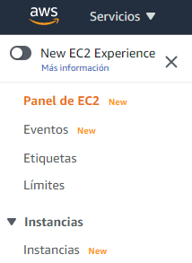

Imagen 1.  Instancias

Acto seguido pulsamos en “Lanzar instancia”.

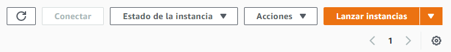

	Imagen 2. Lanzar instancia

A continuación seleccionamos el tipo de imagen (ISO) que queremos usar en nuestra instancia. En nuestro caso usaremos Ubuntu Server 20.04 LTS.

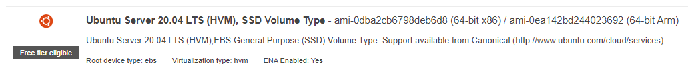

	Imagen 3. ISO Ubuntu Server

En la siguiente ventana, podremos elegir el tipo de máquina que queremos levantar, “hardware”, números de CPUs, HD, etc..

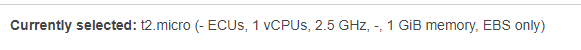

	Imagen 4. Tipo de instancia

Después de seleccionar el tipo de instancia continuamos sin lanzarla, **muy importante** y pasamos al siguiente paso. 

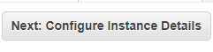

Revisamos que todo lo que necesitamos sea correcto. Cuando lleguemos al último paso, configuramos los grupos de seguridad, es decir los protocolos y puertos que vamos a usar.

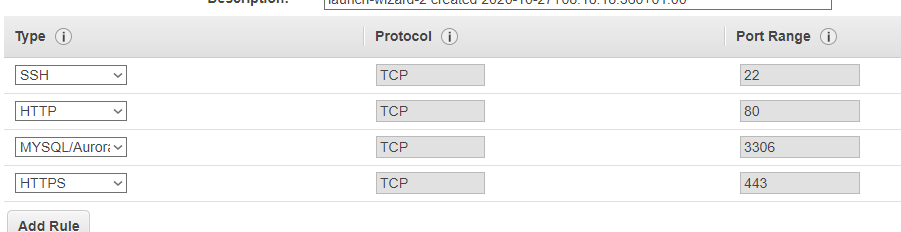

	Imagen 5. Protocolos y puertos usados

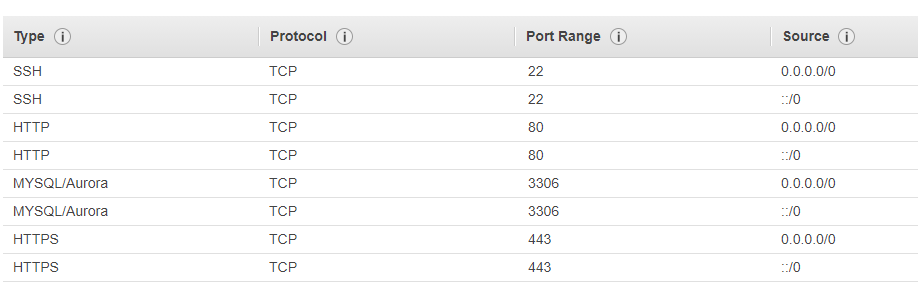

	Imagen 6. Práctica 02 IAW

En nuestro caso quedaría algo así, dependiendo de los servicios que quieras ejecutar.

En el paso final, nos indicará lo necesario para el acceso a través de la consola (SSH). Para ello nos pedirá que seleccionemos una Key existente en caso de tenerla u otra nueva.

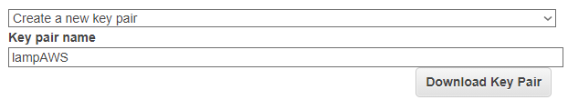

	Imagen 7. Selección de Key

Es muy importante que una vez seleccionada la descarguemos.

Una vez que todo esté configurado y lanzado, podremos ver en el apartado principal de instancias las que tenemos disponibles y su estado. 

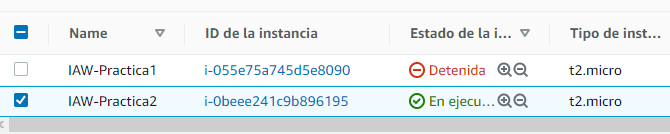

	Imagen 8. Estado de instancias

Una vez seleccionada la instancia, abajo podremos ver un resumen de la misma.

	Imagen 9. Resumen instancia.

-IPs

-ID

-Tipo

-Plataforma...

# Conexión remota

Para acceder a nuestra instancia remotamente es necesario editar el archivo de configuración de SSh. Nosotros lo haremos por Visual Studio Code por la facilidad de trabajar con scripts y poder ejecutarlos en tiempo real en la terminal de forma remota.

Seleccionamos el archivo de configuración.

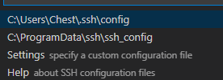

	Imagen 10. Config

Añadimos el nuevo host.

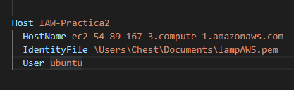

	Imagen 11. Host

Si todo está correcto y bien configurado podremos manejar nuestra instancia de forma remota y así poder empezar la configuración de nuestras máquinas.

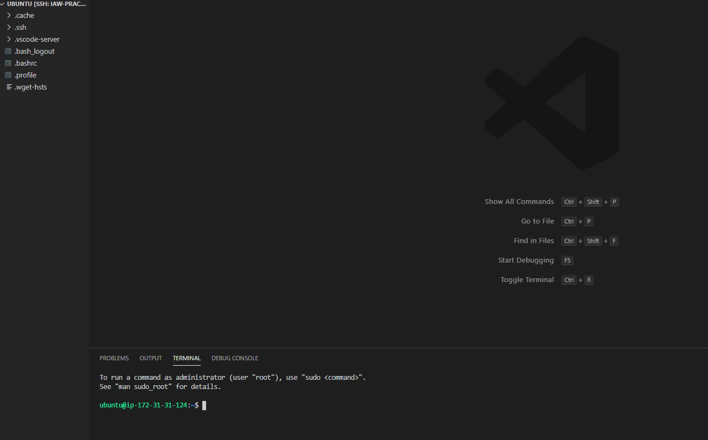

	Imagen 12. Administración remota

Clonamos el repositorio con las herramientas necesarias y lanzamos la instalación.

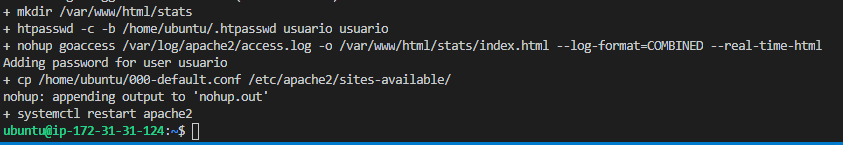

	Imagen 13. Pila lamp

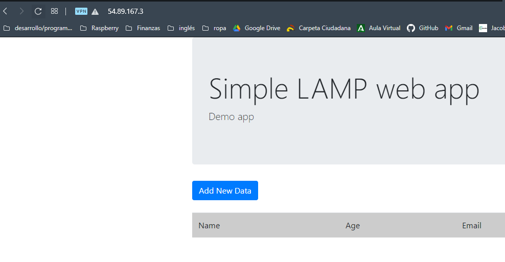

	Imagen 14. Acceso a IP pública
